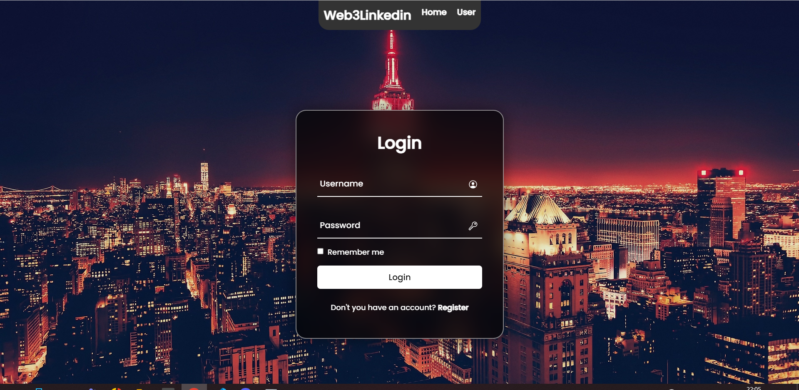
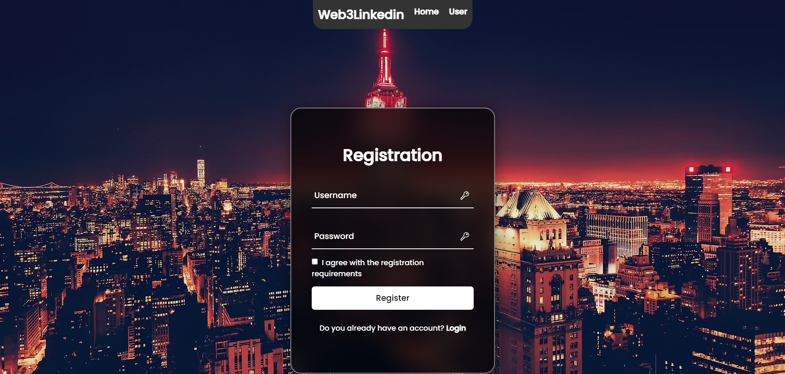
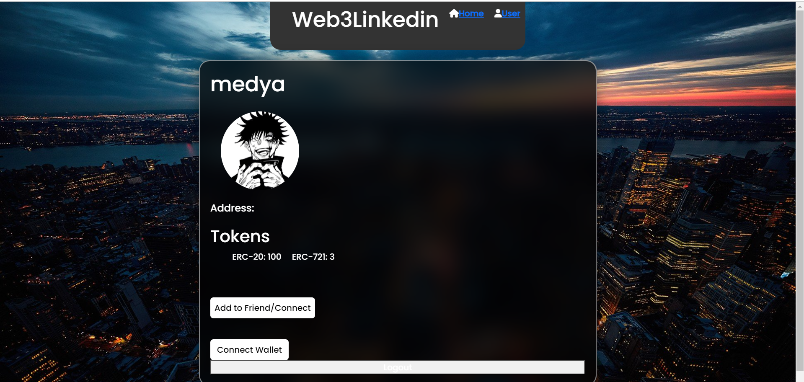
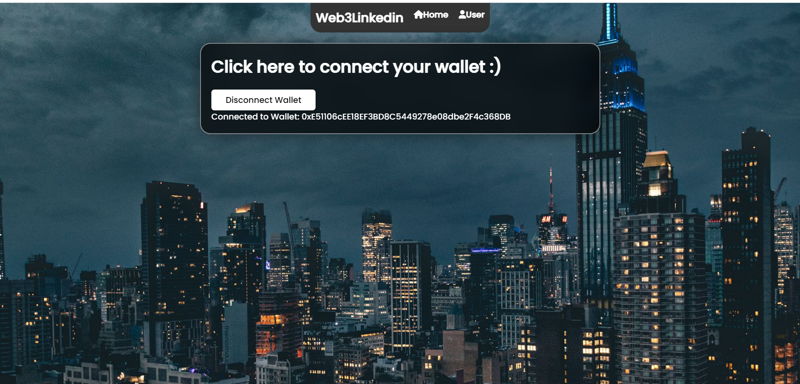

# Node.js project to connect smart contract with frontend

This project demonstrates a linkedin like webservice. There is function of registration and connect Metamaks wallet.
Try running some of the following tasks:

```shell
npm install
node server.js
```
Also you need to configure PostgreSQL database. Create .env file and write following:
```
RPC_URL=https://eth-sepolia.g.alchemy.com/v2/-dgIXUgytGV3cVKbw7gKgSqu5IvZvuBU
CONTRACT_ADDRESS=0xe0849852a604BC8A087476Fa04cA859e21A50490
PRIVATE_KEY=<YOUR_METAMASK_PRIVATE_KEY>
HOST=localhost
PORT=5432
USER=<YOUR_POSTGRES_USER>
PASSWORD=<YOUR_POSTGRES_PASSWORD>
DB=web3_db (create db users with id, username and password columns)
SECRET=ASDFJuS9DFhKNDSF!@3FUF
```









